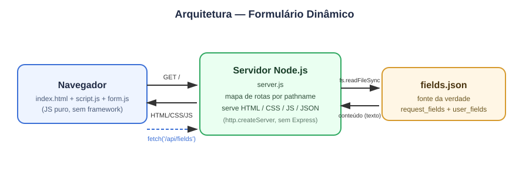
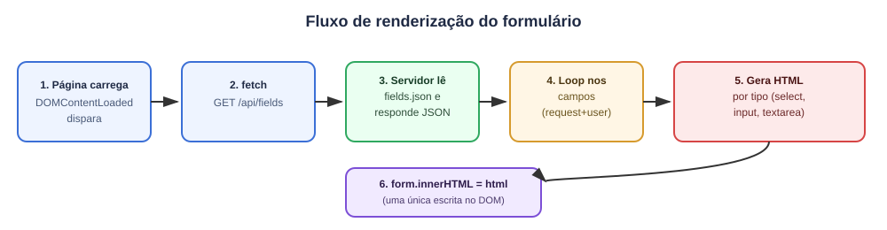

# 🧾 Desafio Frontend — Formulário Dinâmico (GetNinjas)

**Desafio técnico de auto-estudo — sem prazo, sem entrega, feito para aprender fundamentos de HTML/CSS/JS puro e Node.js sem framework.**

Servidor Node.js puro servindo um formulário de pedidos cujos campos são inteiramente gerados a partir de um JSON (`fields.json`), sem nenhuma linha de HTML escrita à mão para os campos.


---

## 📌 Sobre

Referência visual do formulário: [GetNinjas — Cabeleireiros](https://www.getninjas.com.br/moda-e-beleza/cabeleireiros).

A ideia central do desafio **não é** montar 9 campos manualmente — é fazer o sistema **interpretar uma estrutura de dados** e gerar o formulário sozinho:

```
fields.json → servidor entrega como API → JS interpreta → formulário aparece
```

Se um décimo campo for adicionado ao JSON amanhã, a aplicação deveria lidar com ele sem precisar de reconstrução manual.

---

## 📋 Requisitos do desafio

#### Permitido
- ES6
- Linters (JS e CSS)
- Task runners / build tools (Webpack, Gulp, Grunt)
- Sass/SCSS, se justificável
- Ferramentas de teste (jest, jasmine, mocha, chai, sinon, supertest)

#### Não permitido
- Frameworks JS (React, Vue, Angular, Ember...)
- Bibliotecas de utilidades (Lodash, Underscore...)
- Frameworks/bibliotecas CSS (Bootstrap, Foundation...)

#### Especificações funcionais
- Servidor **Node.js** servindo `fields.json` (raiz do projeto) como API — Express é opcional, não usado aqui.
- Campos `enumerable` devem virar `<select>`.
- Campos com `required: true` devem exibir **"este campo é requerido"** quando vazios.
- O formulário **não precisa** fazer `POST`.
- Pelo menos um teste (unitário ou de integração) é essencial.

---

## ✅ Status atual — requisito x implementado

| Requisito do desafio | Status |
|---|---|
| Servidor Node.js servindo `fields.json` como API | ✅ Feito (`http` nativo, sem Express) |
| Servir o HTML/CSS/JS pelo próprio Node | ✅ Feito (mapa de rotas pelo `pathname` de `req.url`) |
| Gerar os campos dinamicamente a partir do JSON | ✅ Feito (loop sobre `request_fields` + `user_fields`) |
| `enumerable` → `<select>` | ✅ Feito |
| Mensagem "este campo é requerido" | ✅ Feito — erro condicional ao sair do campo, alterar a seleção ou tentar avançar/concluir |
| Fluxo passo-a-passo (wizard), como no site de referência | ✅ Feito — um campo por etapa, progresso e botões de avançar/voltar |
| Estilização (CSS) | ✅ Feito — CSS puro com layout responsivo |
| Testes (unitário ou integração) | ✅ Feito — 4 testes com `node:test` para API, arquivos estáticos e validação |
| Nomenclatura em inglês no código | 🟡 Parcial — funções e variáveis em inglês; classes `campo` e `erro` ainda em português |

> Este projeto é uma **demonstração de aprendizado**: já conta com wizard, validação, CSS responsivo e testes. Ao concluir, exibe uma mensagem de sucesso, sem enviar ou persistir os dados.

---

## 🏗️ Arquitetura



- **Servidor** (`api/server.js`): módulo `http` nativo. Sem Express. Consulta um mapa de rotas pelo `pathname` da URL e lê o arquivo correspondente do disco a cada requisição. Aceita `GET` e `HEAD`, com respostas 404, 405 e 500 para erros.
- **Frontend** (`web/`): HTML com layout e controles de navegação. O módulo `script.js` carrega os dados e controla o wizard; `form.js` cria e valida os campos dentro de `<div id="groups">`, no `<form id="form">`.
- **Dados**: `fields.json` na raiz — única fonte da verdade sobre quais campos existem.

---

## 🔄 Fluxo de renderização



1. Página carrega → o navegador executa `script.js` como módulo após interpretar o HTML.
2. `loadFields()` chama `fetch('/api/fields')`, exibindo o estado de carregamento e desabilitando o avanço.
3. Servidor lê `fields.json` do disco e responde com `Content-Type: application/json`.
4. JS verifica os dois arrays em `_embedded` e percorre `request_fields` e depois `user_fields`.
5. `createField()` cria elementos DOM por `type` (`select` para `enumerable`, `textarea` para `big_text`, `input` para os demais), com label e mensagem de validação inicialmente oculta.
6. Os campos são inseridos **de uma vez só** com `groups.replaceChildren(fragment)`. O wizard mostra a primeira etapa e valida antes de avançar; falhas no carregamento exibem a opção de tentar novamente.

---

## 📁 Estrutura

```
frontend-challenge/
├── api/
│   └── server.js         # servidor HTTP puro (sem Express)
├── web/
│   ├── index.html        # layout e estrutura do wizard
│   ├── script.js         # fetch, etapas e navegação
│   ├── form.js           # criação dos campos e validação
│   ├── style.css         # estilos responsivos em CSS puro
│   └── assets/
│       ├── logo.svg
│       └── cabeleireiro.png
├── docs/
│   └── assets/
│       ├── architecture.svg
│       ├── flow.svg
│       ├── banner.png
│       └── organize-docs.sh
├── tests/
│   └── app.test.js        # integração HTTP e validação
├── fields.json           # fonte da verdade dos campos
├── package.json          # scripts e requisito de Node.js
├── package-lock.json
├── LICENSE
└── README.md
```

---

## ▶️ Como executar

Requer **Node.js 22 ou superior**. O projeto não tem dependências externas.

```bash
git clone <url-do-repo>
cd frontend-challenge
node api/server.js
```

Acesse `http://localhost:3000`. Também é possível iniciar com `npm start` e definir outra porta pela variável `PORT`.

Para executar os testes:

```bash
npm test
```

---

## 🧠 Decisões e conceitos praticados

- **`http` nativo em vez de Express**: propositalmente, para entender o que o Express abstrai (roteamento, parsing) antes de usar a abstração.
- **Mapa de rotas fora do handler**: centraliza caminhos e tipos de conteúdo. Os arquivos são lidos com `readFileSync` dentro do handler, a cada requisição.
- **Roteamento pelo `pathname` da URL**: parâmetros de consulta não alteram a rota; cada recurso recebe seu `Content-Type` correspondente.
- **Renderização orientada por dados**: nenhum `<input>`/`<select>` dos 9 campos é escrito à mão — todos vêm do loop sobre o JSON.
- **Criação com APIs do DOM**: `createElement` e `textContent` montam os campos; um `DocumentFragment` reúne os elementos antes da inserção.
- **Estado do wizard**: `currentStep` controla a etapa visível, enquanto os campos permanecem no DOM para preservar as respostas ao voltar.

---

## ⚠️ Limitações conhecidas

- Os testes cobrem HTTP e a função de validação, mas ainda não exercitam a criação dos campos nem a navegação do wizard no navegador.
- Máscaras de CEP/telefone não implementadas; a validação aceita os formatos previstos com ou sem pontuação.
- A conclusão é apenas demonstrativa: não há envio nem persistência das respostas.
- O servidor faz leitura síncrona do disco a cada requisição.
- As classes `campo` e `erro` ainda usam nomenclatura em português.

## 🚀 Próximos passos

- Ampliar os testes para criação dos campos, avanço/retorno, conclusão e nova tentativa após falha no carregamento.
- Implementar máscaras de CEP e celular.
- Padronizar em inglês as classes restantes.
- Avaliar leitura assíncrona ou cache dos arquivos no servidor.

---

## 👨‍💻 Autor

**Luis Botelho**
